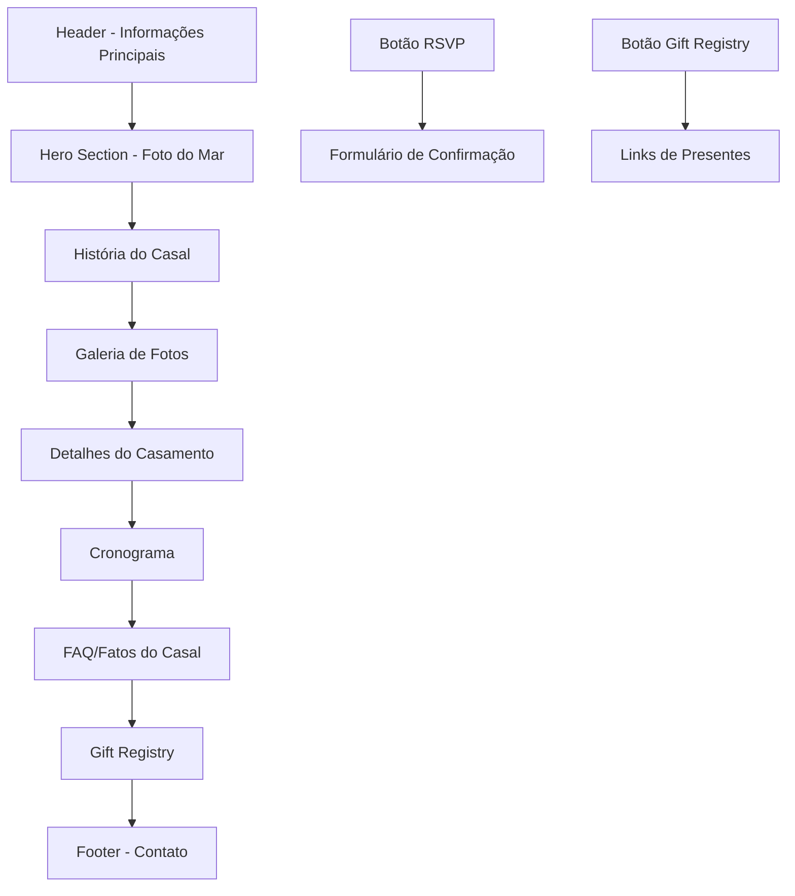

# Product Requirements Document - Site de Casamento Roger & Mylena

## 1. Product Overview

Site elegante para o casamento de Roger e Mylena, com design inspirado na praia de Ipioca. O site servirá como ponto de informação central para convidados confirmarem presença, conhecerem os detalhes do evento e acessarem a lista de presentes.

O produto visa criar uma experiência digital memorável que reflete a personalidade do casal e facilita a comunicação com os convidados, eliminando dúvidas sobre localização, horários, traje e presentes.

## 2. Core Features

### 2.1 User Roles

| Role          | Registration Method      | Core Permissions                                                                |
| ------------- | ------------------------ | ------------------------------------------------------------------------------- |
| Convidado     | No registration required | Visualizar todas as informações, confirmar presença, acessar lista de presentes |
| Casal (Admin) | Private access           | Gerenciar confirmações de presença, atualizar informações do site               |

### 2.2 Feature Module

O site de casamento consiste nas seguintes páginas principais:

1. **Home page**: Header com informações principais, hero section com foto do mar, seção de história do casal, galeria de fotos, detalhes do casamento, cronograma, FAQ, lista de presentes e footer de contato.

### 2.3 Page Details

| Page Name | Module Name           | Feature description                                                                                                             |
| --------- | --------------------- | ------------------------------------------------------------------------------------------------------------------------------- |
| Home page | Header                | Exibir data (13 de Março de 2026), local (Ipioca, Maceió/AL) e botões de navegação para RSVP e Gift Registry                    |
| Home page | Hero Section          | Apresentar foto panorâmica do mar com transição suave e design clean                                                            |
| Home page | História              | Contar a história do casal com texto descritivo e ilustração artística dos noivos                                               |
| Home page | Galeria de Fotos      | Exibir fotos do casal em momentos especiais com layout responsivo                                                               |
| Home page | Detalhes do Casamento | Apresentar 3 colunas com informações sobre Cerimônia (Praia de Ipioca), Recepção (Restaurante Arrecifes) e Traje (Beach Formal) |
| Home page | Cronograma            | Listar horários do evento: 16h (Início), 17h (Cerimônia), 18h (Open Bar), 19h (Jantar)                                          |
| Home page | FAQ/Fatos do Casal    | Responder perguntas frequentes sobre estacionamento, hospedagem e traje                                                         |
| Home page | Gift Registry         | Informar sobre preferências de presentes com links para Shopee/Lazada e opção de contribuição financeira                        |
| Home page | Footer                | Exibir informações de contato para dúvidas dos convidados                                                                       |

## 3. Core Process

**Fluxo do Convidado:**
O convidado acessa o site através do link compartilhado → Visualiza as informações principais no header → Desce pela página conhecendo a história do casal → Verifica detalhes sobre cerimônia, recepção e traje → Confirma o cronograma do evento → Lê as perguntas frequentes → Acessa a lista de presentes → Entra em contato via informações do footer se necessário.

**Fluxo de Confirmação de Presença:**
Convidado clica no botão RSVP → Preenche formulário com nome e número de acompanhantes → Confirma presença → Recebe mensagem de agradecimento → Casal recebe notificação da confirmação.

## 4. User Interface Design

### 4.1 Design Style

* **Cores Primárias**: Creme (#FFF6EE) e Azul Claro (#EAF4FF) em painéis alternados

* **Cores de Acabamento**: Azul Médio (#6AA8E6) para ícones e detalhes, Azul Escuro (#0F2740) para textos

* **Tipografia**: Fonte script/brush para títulos principais (preta), fonte serifada limpa para textos corporativos

* **Estilo de Botões**: Arredondados com fundo azul (#6AA8E6) e texto branco em maiúsculas

* **Ícones**: Estilo line-art desenhado à mão com temática praiana (conchas, ondas, estrelas-do-mar)

* **Layout**: Baseado em cards com seções empilhadas verticalmente e grid responsivo de 3 colunas para detalhes

### 4.2 Page Design Overview

| Page Name             | Module Name            | UI Elements                                                                                                                                                                                  |
| --------------------- | ---------------------- | -------------------------------------------------------------------------------------------------------------------------------------------------------------------------------------------- |
| Header                | Informações Principais | Texto pequeno azul (#6AA8E6) nos cantos superior esquerdo (data) e direito (local), nomes "Roger e Mylena" em fonte script grande centralizada, dois botões azuis centrados abaixo dos nomes |
| Hero Section          | Foto do Mar            | Imagem full-width com altura de 60vh, overlay sutil para garantir legibilidade de elementos sobrepostos                                                                                      |
| História              | Texto e Ilustração     | Container com fundo azul claro (#EAF4FF), texto descritivo centralizado com largura máxima de 800px, ilustração dos noivos em estilo line-art azul posicionada abaixo do texto               |
| Galeria de Fotos      | Grid de Imagens        | Layout em grid responsivo (3 colunas desktop, 1 coluna mobile), imagens com border-radius suave e sombra sutil                                                                               |
| Detalhes do Casamento | 3 Colunas              | Cards lado a lado com ícones line-art azuis acima de cada título, descrições em português com fonte serifada                                                                                 |
| Cronograma            | Timeline Vertical      | Lista com horários à esquerda e descrições à direita, separados por linha azul fina                                                                                                          |
| FAQ                   | Perguntas e Respostas  | Acordeão expansível ou seção com perguntas em negrito seguidas de respostas em texto regular                                                                                                 |
| Gift Registry         | Informações e Contato  | Texto explicativo sobre preferências de presentes, QR code para acesso rápido, informações de contato para assistência                                                                       |

### 4.3 Responsiveness

O site será desenvolvido com abordagem **desktop-first** mas totalmente responsivo para dispositivos móveis. Em telas menores que 768px: header com informações empilhadas, hero section com altura reduzida, grid de fotos em coluna única, detalhes do casamento em cards verticais, timeline com horários acima das descrições. Otimização para touch com áreas de clique aumentadas e navegação simplificada.

### 4.4 Elementos Interativos

* Botões RSVP e Gift Registry com hover effect sutil (leve escurecimento)

* Animação de scroll suave entre seções

* Transições fade-in para elementos ao entrar na viewport

* Formulário de RSVP com validação em tempo real e feedback visual

* Links externos abrindo em nova aba com ícone indicador

